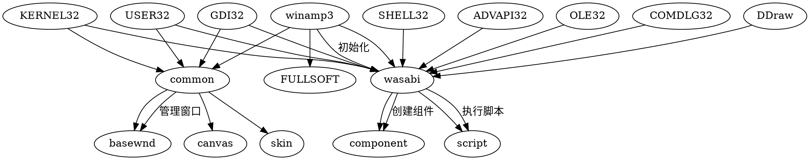

# Stage 2: 接口与依赖推导

## 提取时间
2026-09-07 19:20

## 外部调用分析

### 1. 系统 API 调用

| 库 | 函数 | 用途 |
|----|------|------|
| KERNEL32.dll | wasabi_getKernel | 获取 Wasabi 内核接口 |
| KERNEL32.dll | LoadLibrary/FreeLibrary | 动态加载 DLL |
| USER32.dll | WindowFromPoint | 窗口点查询 |
| GDI32.dll | CreateDIBSection | 创建 DIB 区域 |
| GDI32.dll | GetDC/ReleaseDC | 获取释放设备上下文 |
| ADVAPI32.dll | OutputDebugStringA | 调试输出 |

### 2. COM/COM+ 接口

**发现**: 只有 `CLSID` 字符串，缺少具体 GUID 值

### 3. 依赖库清单

| 依赖库 | 用途推测 | 状态 |
|--------|---------|------|
| KERNEL32.dll | Windows 内核函数 | ✅ 系统库 |
| USER32.dll | Windows 窗口管理 | ✅ 系统库 |
| GDI32.dll | Windows 图形设备接口 | ✅ 系统库 |
| SHELL32.dll | Windows Shell 功能 | ✅ 系统库 |
| ADVAPI32.dll | Windows 高级 API | ✅ 系统库 |
| MSVCRT.dll | Microsoft C 运行时 | ✅ 系统库 |
| DDraw.dll | DirectDraw 图形加速 | ✅ 系统库 |
| OLE32.dll | COM 核心库 | ✅ 系统库 |
| COMDLG32.dll | Windows 通用对话框 | ✅ 系统库 |
| FULLSOFT.DLL | 软件解码器 | ⚠️ 自定义库 |
| wasabi.dll | Wasabi 框架核心 | ✅ 项目库 |
| common.dll | 公共组件库 | ✅ 项目库 |

## 缺失接口推导

### 1. Wasabi 内核接口 (wasabi_getKernel)

**推测签名**:
```cpp
// wasabi.h (推测)
namespace Wasabi {
    class Kernel {
    public:
        // 插件管理
        IComponent* GetComponent(const char* componentId);
        void RegisterComponent(IComponent* component);

        // 脚本引擎
        ScriptObject* CreateScriptObject(const char* className);

        // 文件系统
        IFile* OpenFile(const char* path);
        IPlaylist* CreatePlaylist();

        // 配置系统
        IConfig* GetConfig();
    };
}

extern "C" Wasabi::Kernel* wasabi_getKernel();
```

### 2. 组件接口 (IComponent)

**推测定义**:
```cpp
// component.h (推测)
#include <windows.h>

interface IComponent : public IUnknown {
    // 生命周期
    virtual HRESULT STDMETHODCALLTYPE Init() = 0;
    virtual HRESULT STDMETHODCALLTYPE Quit() = 0;

    // 配置
    virtual HRESULT STDMETHODCALLTYPE GetConfig(IConfig** config) = 0;
    virtual HRESULT STDMETHODCALLTYPE SetConfig(IConfig* config) = 0;

    // 脚本钩子
    virtual HRESULT STDMETHODCALLTYPE AddScriptHook(ScriptHook* hook) = 0;

    // 类信息
    virtual HRESULT STDMETHODCALLTYPE GetClassName(WCHAR** className) = 0;
    virtual HRESULT STDMETHODCALLTYPE GetClassId(int* classId) = 0;
};
```

### 3. 脚本对象接口 (ScriptObject)

**推测定义**:
```cpp
// script.h (推测)
class ScriptObject {
public:
    virtual const char* GetClassName() = 0;
    virtual int GetClassId() = 0;
    virtual int GetAncestorClassId() = 0;
    virtual const char* GetAncestorClassName() = 0;
    virtual int IsNumeric(int value) = 0;
};
```

### 4. 窗口抽象层 (BaseWindow)

**推测定义**:
```cpp
// basewnd.h (推测)
class BaseWindow {
protected:
    HWND hwnd;
    HDC hdc;
    Canvas* canvas;
    BaseWindow* basewnd;

public:
    virtual ~BaseWindow() {}
    virtual void OnPaint() = 0;
    virtual void OnMouseDown(int x, int y) = 0;
    virtual void OnMouseMove(int x, int y) = 0;
    virtual void OnMouseUp(int x, int y) = 0;
    virtual void OnKeyDown(int keyCode) = 0;
    virtual void OnKeyUp(int keyCode) = 0;
    virtual void OnChar(char ch) = 0;

    HWND GetHwnd() const { return hwnd; }
    Canvas* GetCanvas() const { return canvas; }
};
```

## 模块依赖图 (deps.dot)



## 推导的函数签名

### Wasabi 框架

```cpp
// wasabi.h
namespace Wasabi {

class Kernel {
public:
    // 插件管理
    virtual HRESULT STDMETHODCALLTYPE GetComponent(
        const char* componentId,
        IComponent** component) = 0;

    virtual HRESULT STDMETHODCALLTYPE RegisterComponent(
        IComponent* component) = 0;

    // 脚本引擎
    virtual ScriptObject* CreateScriptObject(
        const char* className) = 0;

    // 文件系统
    virtual IFile* OpenFile(const char* path) = 0;
    virtual IPlaylist* CreatePlaylist() = 0;

    // 配置
    virtual IConfig* GetConfig() = 0;
};

extern "C" __declspec(dllexport) Wasabi::Kernel* wasabi_getKernel();

} // namespace Wasabi
```

### 组件系统

```cpp
// component.h
#include <unknwn.h>

class IComponent : public IUnknown {
public:
    virtual HRESULT STDMETHODCALLTYPE Init() = 0;
    virtual HRESULT STDMETHODCALLTYPE Quit() = 0;
    virtual HRESULT STDMETHODCALLTYPE GetConfig(IConfig** config) = 0;
    virtual HRESULT STDMETHODCALLTYPE SetConfig(IConfig* config) = 0;
    virtual HRESULT STDMETHODCALLTYPE AddScriptHook(ScriptHook* hook) = 0;
    virtual HRESULT STDMETHODCALLTYPE GetClassName(WCHAR** className) = 0;
    virtual HRESULT STDMETHODCALLTYPE GetClassId(int* classId) = 0;
};

class IConfig : public IUnknown {
public:
    virtual HRESULT STDMETHODCALLTYPE GetString(
        const char* section,
        const char* key,
        char* buffer,
        int bufferSize) = 0;

    virtual HRESULT STDMETHODCALLTYPE SetString(
        const char* section,
        const char* key,
        const char* value) = 0;
};

class IFile : public IUnknown {
public:
    virtual HRESULT STDMETHODCALLTYPE Open(const char* path, int mode) = 0;
    virtual HRESULT STDMETHODCALLTYPE Read(void* buffer, int size, int* bytesRead) = 0;
    virtual HRESULT STDMETHODCALLTYPE Write(const void* buffer, int size) = 0;
    virtual HRESULT STDMETHODCALLTYPE Close() = 0;
};

class IPlaylist : public IUnknown {
public:
    virtual HRESULT STDMETHODCALLTYPE AddFile(const char* path) = 0;
    virtual HRESULT STDMETHODCALLTYPE LoadFromFile(const char* path) = 0;
    virtual HRESULT STDMETHODCALLTYPE SaveToFile(const char* path) = 0;
    virtual HRESULT STDMETHODCALLTYPE GetFileCount(int* count) = 0;
    virtual HRESULT STDMETHODCALLTYPE GetFile(int index, char** path) = 0;
};
```

### 脚本系统

```cpp
// script.h
class ScriptHook {
public:
    virtual HRESULT STDMETHODCALLTYPE Execute() = 0;
};

class ScriptObject {
public:
    virtual const char* GetClassName() = 0;
    virtual int GetClassId() = 0;
    virtual int GetAncestorClassId() = 0;
    virtual const char* GetAncestorClassName() = 0;
    virtual int IsNumeric(int value) = 0;
};

class ScriptObjectController {
public:
    virtual HRESULT STDMETHODCALLTYPE GetClassName(
        const char* className,
        const char** result) = 0;

    virtual HRESULT STDMETHODCALLTYPE GetClassId(
        const char* className,
        int* classId) = 0;

    virtual HRESULT STDMETHODCALLTYPE SetClassId(
        const char* className,
        int classId) = 0;

    virtual HRESULT STDMETHODCALLTYPE GetAncestorClassName(
        const char* className,
        const char** result) = 0;

    virtual HRESULT STDMETHODCALLTYPE GetAncestorClassId(
        const char* className,
        int* classId) = 0;

    virtual HRESULT STDMETHODCALLTYPE AddClassHook(
        const char* className,
        ScriptHook* hook) = 0;
};
```

### 窗口系统

```cpp
// basewnd.h
#include <windows.h>

class Canvas {
public:
    virtual HRESULT STDMETHODCALLTYPE GetHDC(HDC* hdc) = 0;
    virtual HRESULT STDMETHODCALLTYPE BeginPaint() = 0;
    virtual HRESULT STDMETHODCALLTYPE EndPaint() = 0;
    virtual HRESULT STDMETHODCALLTYPE DrawRect(int x, int y, int w, int h, COLORREF color) = 0;
    virtual HRESULT STDMETHODCALLTYPE FillRect(int x, int y, int w, int h, COLORREF color) = 0;
    virtual HRESULT STDMETHODCALLTYPE DrawText(const char* text, int x, int y) = 0;
};

class BaseWindow {
protected:
    HWND hwnd;
    HDC hdc;
    Canvas* canvas;
    BaseWindow* basewnd;

public:
    virtual ~BaseWindow() {}
    virtual void OnPaint() = 0;
    virtual void OnMouseDown(int x, int y) = 0;
    virtual void OnMouseMove(int x, int y) = 0;
    virtual void OnMouseUp(int x, int y) = 0;
    virtual void OnKeyDown(int keyCode) = 0;
    virtual void OnKeyUp(int keyCode) = 0;
    virtual void OnChar(char ch) = 0;

    HWND GetHwnd() const { return hwnd; }
    Canvas* GetCanvas() const { return canvas; }
};
```

## 接口置信度

| 接口 | 置信度 | 说明 |
|------|--------|------|
| wasabi_getKernel | 高 | 字符串明确 |
| IComponent | 中 | 基于组件桶模式推测 |
| ScriptObject | 高 | 有类名和函数名线索 |
| IConfig | 中 | 配置系统常见模式 |
| IFile | 中 | 文件操作接口 |
| IPlaylist | 中 | 播放列表接口 |
| BaseWindow | 高 | 有窗口和画布标识 |
| Canvas | 高 | 有画布相关字符串 |

## 下一步行动

1. ✅ 创建接口头文件到 `stubs/` 目录
2. ⏳ 创建构建系统配置
3. ⏳ 搭建工程骨架
4. ⏳ 放置碎片代码
5. ⏳ 编译纠错迭代
